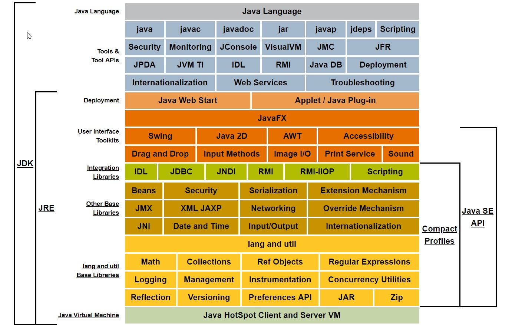
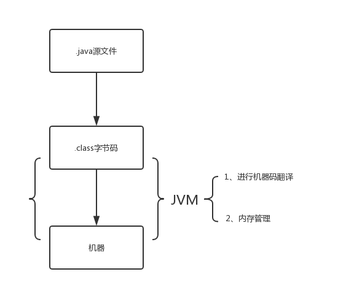
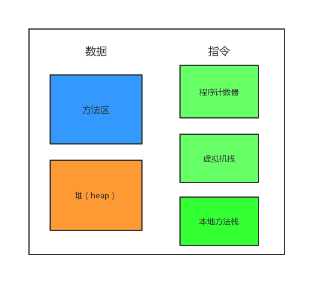
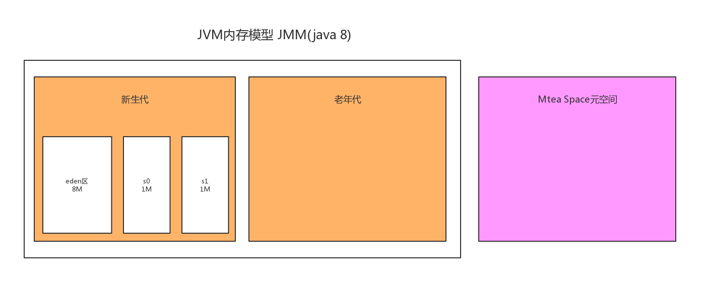
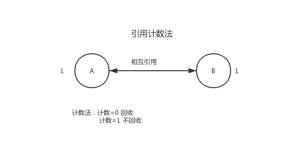
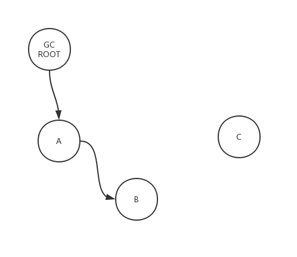

# JVM学习 #
## 一、Java概念图的描述 ##

## 二、JVM是什么？ ##

1. 软件层面：可自动将Java字节码文件编译为机器能够识别的指令
2. 内存管理

## 三、JVM内部体系结构 ##
- 类装载器（ClassLoader）子系统
- 运行时数据区
- 执行引擎

### 类装载器 ###
每一个Java虚拟机都由一个类加载器子系统（class loader subsystem），负责加载程序中的类型（类和接口），并赋予唯一的名字。每一个Java虚拟机都有一个执行引擎（execution engine）负责执行被加载类中包含的指令。JVM的两种类装载器包括：启动类装载器和用户自定义类装载器，启动类装载器是JVM实现的一部分，用户自定义类装载器则是Java程序的一部分，必须是ClassLoader类的子类。

### 执行引擎 ###
它或者在执行字节码，或者执行本地方法

### 运行时数据区 ###
主要包括：**方法区**，**堆**，**虚拟机栈**，**程序计数器**，**本地方法栈**

-  **程序计数器**：指向当前线程正在执行字节码指令地址 行号
-  **虚拟机栈**：存储当前线程运行方法所需要的数据、指令、返回地址
-  **本地方法栈**：存储 native 方法
-  **方法区**：类信息、常量、静态变量、JIT
-  **堆**：存储对象

## JVM内存模型 JMM(java 8) ##
主要有**新生代（Young）** 和 **老年代（Old）**，其中新生代（Young）又被分为2个部分，分别是1个Eden区，和2个Survivor区（一般叫s0,s1）

1. Eden区：用来存放使用new或者newInstance等方式创建的对象，默认都是存放在Eden区，除非这个对象太大，或者超过了设定的阈值-XX:PretenureSizeThresold,这样的对象会被直接分配到Old区
2. Survivor区：在不断创建对象的过程中,Eden区会满，这个时候就是进行垃圾回收，执行**Young GC(Minor GC)** ,Young GC会找出存活的对象放到s0或者s1中

## Java命令集 ##
> javap -c -v 字节码文件 >内容存放文件 例如：javap -c -v TestJVM.class > p.txt

## Java字节码指令参考 ##
[https://www.cnblogs.com/longjee/p/8675771.html](https://www.cnblogs.com/longjee/p/8675771.html "字节码指令参考")

## 四、JVM垃圾回收机制 ##
### 什么样的对象会被回收 ###
- 判断算法
	- 引用计数法
	- 可达性分析法(GCroot)
		- 虚拟机栈中本地变量表引用的对象
		- 方法区中：1、静态变量引用的对象 2、常量引用的对象
	- 本地方法栈中引用的对象

引用计数法：

可达性分析算法：

### GC方式 ###
- 新生代：minorGC
- 老年代：majorGC 比minorGC慢10倍

## 五、JVM调优 ##
1. 元空间调优
2. 优化代码

### 元空间调优方法 ###
主要参数：

    UseLargePagesInMetaspace
    InitialBootClassLoaderMetaspaceSize
    MetaspaceSize
    MaxMetaspaceSize
    CompressedClassSpaceSize
    MinMetaspaceExpansion
    MaxMetaspaceExpansion
    MinMetaspaceFreeRatio
    MaxMetaspaceFreeRatio

## JVM参数 ##
官方地址：[https://www.oracle.com/technetwork/java/javase/tech/vmoptions-jsp-140102.html](https://www.oracle.com/technetwork/java/javase/tech/vmoptions-jsp-140102.html "JVM参数查询")

    -Xms20M 堆的起始大小
    -Xmx	堆的最大值
    -Xmn	堆的新生代大小
	-XX:SurvivorRatio=n

## 工具使用 ##
    jmap -heap 5880 查询堆的配置信息