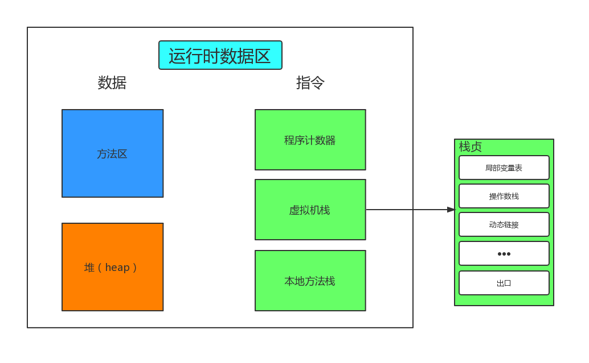

# JVM学习 #
## 一、Java概念图的描述 ##

## 二、JVM是什么？ ##

1. 软件层面：可自动将Java字节码文件编译为机器能够识别的指令
2. 内存管理

## 三、JVM内部体系结构 ##
- 类装载器（ClassLoader）子系统
- 运行时数据区
- 执行引擎

### 类装载器 ###
每一个Java虚拟机都由一个类加载器子系统（class loader subsystem），负责加载程序中的类型（类和接口），并赋予唯一的名字。每一个Java虚拟机都有一个执行引擎（execution engine）负责执行被加载类中包含的指令。JVM的两种类装载器包括：启动类装载器和用户自定义类装载器，启动类装载器是JVM实现的一部分，用户自定义类装载器则是Java程序的一部分，必须是ClassLoader类的子类。

### 执行引擎 ###
它或者在执行字节码，或者执行本地方法

### 运行时数据区 ###
主要包括：**方法区**，**堆**，**虚拟机栈**，**程序计数器**，**本地方法栈**

-  **程序计数器**：指向当前线程正在执行字节码指令地址 行号
-  **虚拟机栈**：存储当前线程运行方法所需要的数据、指令、返回地址
-  **本地方法栈**：存储 native 方法

## JVM内存模型 JMM(java 8) ##

## Java命令集 ##
> javap -c -v 字节码文件 >内容存放文件 例如：javap -c -v TestJVM.class > p.txt

## Java字节码指令参考 ##
[https://www.cnblogs.com/longjee/p/8675771.html](https://www.cnblogs.com/longjee/p/8675771.html "字节码指令参考")